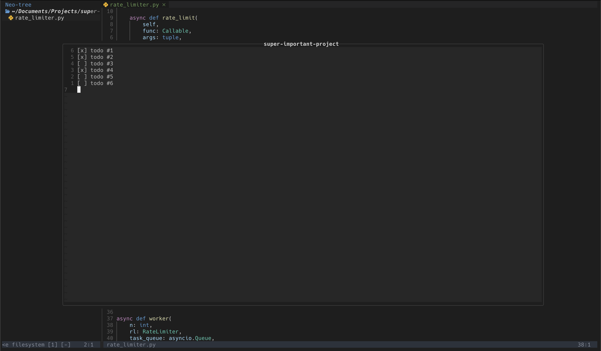
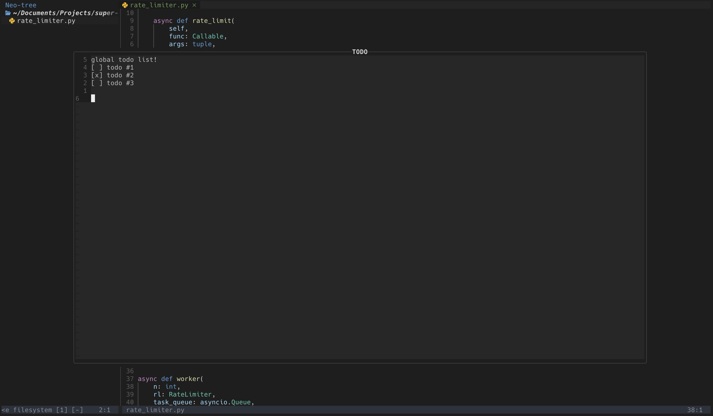

# Tasklist.nvim
A floating window plugin for easy access to todos and other notes



---



## 📦 Installation

Install the plugin with your preferred package manager:

### [Lazy](https://github.com/folke/lazy.nvim)

```lua
-- Lua
return {
  "rrossmiller/tasklist.nvim",
  config = function(opts)
    local todo = require("tasklist")
    vim.keymap.set("n", "<leader>tt", function() todo.toggle_window() end, { desc = 'Open global TODOs window' })
    vim.keymap.set("n", "<leader>tp", function() todo.toggle_proj_window() end, { desc = 'Open project TODOs window' })
    todo.setup()
  end
},
```


## ⚙️  Configuration

**Tasklist** comes with the following defaults:
```lua
{
    dir = vim.fn.expand(vim.fn.stdpath("state") .. "/todos/"), -- directory where todo files are saved. ~/.local/store/nvim/todos/
    style = '', -- neovim supports blank, or simple
    border = 'rounded', -- nvim allows allows: https://neovim.io/doc/user/api.html#api-win_config:~:text=%27winhighlight%27.-,border
}
```


## Known issues
Be careful having multiple instances of nvim with the same todo window open. For example, if you have one nvim instance opened in the `api/` dir 
and another in the `ui/` dir of the same repo. If each instance has the project's todo window open, the todos saved in one instance (when the
window is closed) will be overwritten when the other closes its window.

I have a plan to fix this.

## 🛠️ Roadmap
- [x] read and write todos in buffer from/to a file
- [x] project/repo-level vs global todo 
- [ ] sync the instances/open windows (rpc)
  - update the window whenever any todo window/file was updated
  - only update the window if the underlying file was updated
- [ ] fancy icons marking doneness?
    - change a prefix of a line to mean that the todo is done and the style of the line should change to reflect that
